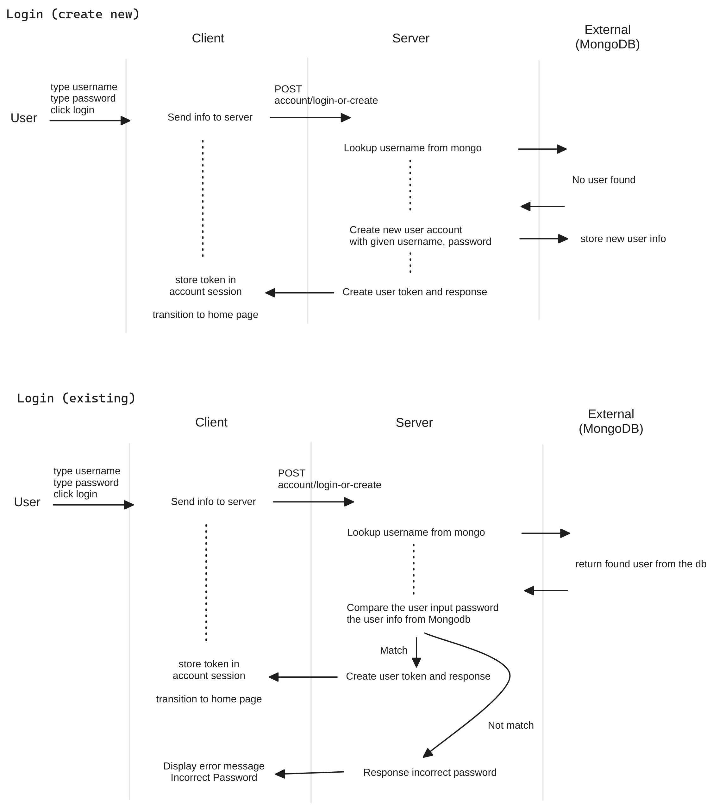

# PantryPal

This document captures current status of PantryPal for further development.

## Client


## Server


## Login Flow



When client try to log in into the server with username and password, server checks the information with mongodb and then create a token for that specific account and returns to the client. Then, the client hold that token until the app is closed (for now).

- The token is generated at `AccountHttpHandler` using username and password.
- From the client side, you can find token is loaded into the account session. Check `Controller`.
- Then we use the token when we request any info from the server ServerRecipeModel Check `ServerRecipeGenerator`.
- Token generation is followed by [Basic access authentication](https://en.wikipedia.org/wiki/Basic_access_authentication) which is simply `username:password` format with base64 encoding.

`AccountContext` is for the server part. Since authenticator only checks the requested token is valid, we loaded user information into account context so that we can use it in repository.

- mongodb basic authenticator saves username into account context for any http handler operation. Check `MongoDBBasicAuthenticator`.
- we uses it in the repository implementation. Check `MongoDBRecipeRepository`.


## REST API Specification

When we have a resource on the sever, returns resource object.

### `/recipe`

#### GET

GET request returns recipes/recipe that we want to display.

##### without querystring

URL: `/recipe`
Expected response: a list of recipes

```json
{
  "recipes": [
    {
      "title": "Tomato, Cucumber, and Egg Salad",
      "description": "1. Boil the eggs until they are hard-boiled. Let them cool and then peel and chop them.\n2. Wash and dice the tomato and cucumber.\n3. In a large bowl, combine the chopped eggs, diced tomato, and cucumber.\n4. Toss the ingredients together.\n5. Season with salt and pepper to taste.\n6. Serve as a refreshing and healthy dinner salad."
    }
  ]
}
```

##### with querystring

URL: `/recipe?id=1000`
Expected behavior: find the recipe using given index of the list.
Expected response: a single recipe, or empty if does not exist

```json
{
  "title": "Tomato, Cucumber, and Egg Salad",
  "description": "1. Boil the eggs until they are hard-boiled. Let them cool and then peel and chop them.\n2. Wash and dice the tomato and cucumber.\n3. In a large bowl, combine the chopped eggs, diced tomato, and cucumber.\n4. Toss the ingredients together.\n5. Season with salt and pepper to taste.\n6. Serve as a refreshing and healthy dinner salad."
}
```

#### POST

URL: `/recipe`
Request body: `title`, `description`
Expected response: no response

```json
{
  "title": "Tomato, Cucumber, and Egg Salad",
  "description": "..."
}
```

#### PUT

URL: `/recipe?id=1000`
Request body: `title`, `description`
Expected response: no response

```json
{
  "title": "Tomato, Cucumber, and Egg Salad",
  "description": "..."
}
```

#### DELETE

URL: `/recipe?id=1000`
Expected response: no response

### Generating Recipe: `/recipe/generate`

#### POST

URL: `/recipe/generate`
Request body: two audio files 'ingredients_file' and 'meal_type_file'
Expected response: generated recipe by ChatGPT

Note: we don't have an ID yet. User will decide to save it. When click the save button, this information need to be submitted to `/recipe` via POST request method.

```json
{
  "title": "Tomato, Cucumber, and Egg Salad",
  "description": "1. Boil the eggs until they are hard-boiled. Let them cool and then peel and chop them.\n2. Wash and dice the tomato and cucumber.\n3. In a large bowl, combine the chopped eggs, diced tomato, and cucumber.\n4. Toss the ingredients together.\n5. Season with salt and pepper to taste.\n6. Serve as a refreshing and healthy dinner salad."
}
```

## Appendix

### Generating Recipe

